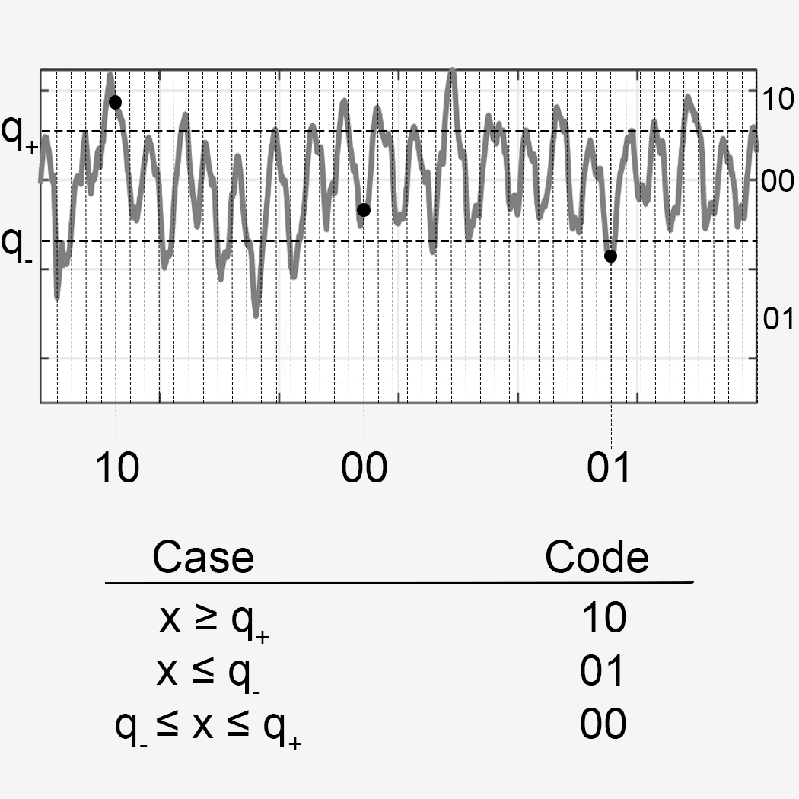

***
# Executive Summary
(Samson) At-home screening systems for obstructive sleep apnea (OSA) utilizes contactless and contact-based sensing modalities, which allow for reliable remote chronic disease management. However, multimodality screening systems are vulnerable to wireless exploitations for device pairing as patients switch between modalities during screening tests. Malicious attacks from non-compliant patients would be able to manipulate the data by eavesdropping or spoofing the wireless signal. To mitigate all attacks, we present **SIENNA**, an in**SI**der r**E**sista**N**t co**N**text-based p**A**iring protocol. SIENNA leverages JADE-ICA to identify a user’s respiration pattern within a multi-person environment and uses fuzzy commitment for automatic device pairing. Friendly jamming techniques would be used to prevent an insider with knowledge of respiration patterns from acquiring the pairing key. Our results show that SIENNA is able securely pair devices with more than 90% success rate under noisy environments and is robust against attackers with full knowledge context information.

***
# Presentation


***

# Highlights


***

# Introduction
(Alana) text here

***

# Background
(Alana) text here

***

# Methodology  
[//]: # (Steph)  
SIENNA incorporates four main elements to ensure that the breathing pattern monitored by the PRMS is that of the desired patient, and protect the transmitted information from eavesdropper attacks.

## JADE-ICA
Joint Approximate Diagonalization of Eigenmatrices for Independent Component Analysis (JADE-ICA) is an algorithm for separating independent sources from a mixed signal. SIENNA uses JADE-ICA to separate mixed breathing patterns, in the event the PRMS picks up the breathing of multiple subjects.  
JADE-ICA approximates a source matrix $S$, composed of a column vector for each source signal $s_i(t)$, where $i=1 ... N$, and $N$ represents the number of independent sources (i.e., the number of distinct breathing patterns present). The input is provided as a mixed matrix $X$, which is assumed to be a linear combination of sources $s_i(t)$. Thus, $X$ can be described by the equation $X = W\times S$, where $W$ is a matrix describing how the independent sources are mixed.  
To approximate the mixing matrix $W$, we first apply Principle Component Analysis (PCA) to the input matrix $X$, resulting in $P = B\times X$. PCA identifies the orthogonal vectors along which there is the most variance, so the columns of $P$ will be perfectly orthogonal, regardless of rotation.
$P$ is then rotated to obtain maximum independence between its row vectors, with the rotation matrix $V$. This gives us our mixing matrix $W=V\times B$.

## Level-Crossing Quantization
Level-crossing quantization is an algorithm for producing a binary representation of an analog signal. SIENNA uses level-crossing quantization to produce a fingerprint for the breathing pattern of the target patient.  

  

*Figure: Illustration of level-crossing quantization with two thresholds.*   

We define a number of set thresholds $q$ with a unique binary representation for each space between thresholds, given by $QTZ(x)$. The value of $x$ at each sample time is transformed by $QTZ(x)$ into a binary code representing its position between the thresholds.

## Fuzzy Commitment
The fuzzy commitment scheme uses Reed-Solomon encoding to incorporate error tolerance into cryptographic commitment generation. This allows SIENNA to accept close matches to the target breathing pattern, within a controllable threshold.
First, the transmitter $a$ and the receiver $b$ both extract fingerprints $f_a$ and $f_b$ using a combination of the above methods. To thwart mix-up attacks, we need to consider $f_a$ and $f_b$ a match if and only if they are within a set threshold. This is accomplished by first encoding a key salt $s$ with Reed-Solomon encoding, giving us $l=RS(s)$. We then compute the commitment $c$ as $l$ XOR $f_a$, and transmit the result.
Upon receiving the commitment, $b$ extracts $\hat{l}=c$ XOR $f_b$. Using the Reed-Solomon decoding function, we decode $\hat{s}=\overline{RS}(\hat{l})$. Due to the error-correction capability of Reed-Solomon codes, $s=\hat{s}$ if and only if $l$ and $\hat{l}$ differ by a set number of bits.  
A hash function $H$ is used to compare $s$ and $\hat{s}$. The “hardness” of the security in this approach is based on the number of bits used in the hash function and the number of bits used in the key salt. With 128 bits for the key salt and 256 bits for the hash function, the hardness is comparable to SHA-256 encryption. 

## Friendly Jamming
SIENNA uses a friendly jamming scheme to thwart eavesdropping. SIENNA transforms commitments into Orthogonal Frequency-Division Multiplexing (OFDM) symbols, and transmits them in duplicate. The receiver then randomly jams either the original symbol or the duplicate. Since the jammed symbols are difficult to distinguish from the unjammed symbols, only the receiver can identify which symbols are jammed and reconstruct the original message.

  

*Figure: Overview of the fuzzy commitment and friendly jamming process.*  
***

# Implementation
Sienna was tested using a customized mmwave radar from TMYTEK, specifically their BBox and UP/Down Converter. This setup uses a 28GHZ OFDM radar controlled with National Instruments USRP 2974 and interfaced through labview, along with the Pnuemotrace 1132 respiratory sensor. During testing the android device communicates with our host computers through BLE and is connected to our labview implementation, which executes the modality switching and data logging. Our eavesdropper slash spoofer was based on a BLE device using Kismet and Ubertooth.

***

# Experimentation
  For testing purposes we had two testing setups, one indoor and another one outdoors. The indoor setup uses two twin beds, whilst the outdoors setup uses beach mats and umbrellas. Both setups tested in similar fashions with the subjects wearing the respiratory sensors and .5 meters below our mmwave radar. Each experiment lasted approximately 1 hour, during which we toggled modality switches and adversarial attacks through our BLE eavesdropper slash spoofer every 10 minutes. 
  During each experiment a third-party executed the modality switches and operated the computer running the Ubertooth. The packets transmitted by the OSA application, the chest-band, and the mmWave radar were identified based on their Bluetooth Device Addresses (BDAs) obtained prior of the experiment
To implement eavesdropping attacks, the hosts codes record the packets containing fuzzy commitment and hash values of new keys from the modality switch.
	The spoofing attack was done with a attacker-generated compliance tracking data encrypted with the deduced key which was transmitted  at  higher  power  during  data  upload  toward the  android app,  in  attempt  to  manipulate  the  latter  into  accepting the fraudulent data, which was verified during offline analysis.
  


***

# Results and Analysis
(Samson) The breathing signature was quantized by utilizing Labview to generate binary fingerprints. The breathing signature is a combination of complex thorax motions, due to respiration and heartbeat movements within +/- 0.5cm to +/- 0.05cm. A quantization step size of 0.05cm at 10 sample rates per second was the best to preserve fine movements. The quality of the binary fingerprints was evaluated based on the hamming distances between fingerprints observed by different modalities. Human subjects are distinguishable based on their inhales exhales and breathing depth which can be directly translated to the hamming distances. The similarities of same subjects observed by different modalities demonstrates an average hamming distance per bit between fingerprints is around 63% within the first 6 seconds. Meanwhile, the similarities between different subject observed by different modalities results an average hamming distance per bit between fingerprints is below 5%. Overall, SIENNA can be set to around 70% to allow accurate patient tracking during modality switches. The security of the fuzzy commitment is measured by the randomness of the commitments. Our results show that the entropy per bit drops nearly by half when the key salt is converted into a commitment due to the redundancy of the human respiratory motion’s cyclic character. Other factors also include when the quantization levels increase, the granularity of the binary sequencing improves, which slightly improves the randomness of the breathing fingerprints, resulting in a higher degree of entropy in the commitments. Also, when the commitment is generated with multiple rounds of XOR operations, the entropy decreases due to the cross-correlation between fingerprint segments. SIENNA’s performance against eavesdropping and spoofing is evaluated by comparing the bit error rate (BER) at the receiver versus the aggregated BER at the attacker’s side. Our experiment showed that the jamming signal could suppress the attacker’s BER to roughly 50%, which would render an undecodable message for the attacker. 

***
# Conclusion
(Samson) SIENNA, a novel insider-resistant context based pairing scheme for multi-modality OSA screening systems successfully secures device pairing by employing fuzzy commitment, friendly jamming, and JADE-ICA. SIENNA leverages the unique patterns of a person’s breathing dynamics for secure pairing and mitigates co-located attackers. Attackers with no knowledge of context can be avoided with fuzzy commitment. Attackers with general knowledge of context can be avoided by committing and decommitting multiple samples, taking advantage of the Yao’s XOR lemma properties. Finally, attackers with full knowledge of context can be avoided by employing friendly jamming. Overall, SIENNA is capable of protecting the security key during a pairing process against any attackers equipped with complete knowledge of the context information.

***
# Appendix
## Equipment
-PRMS 
  -TMYTEK mmWave Kit, NI USRP
-Wireless Respiratory belt
  -Pneumotrace 1132
-OSA app 
  -Android app with modality switching
-Eavesdropper 
  -BLE with Kismet and Ubertooth

***
# Acknowledgement
This project is partially supported NSF grants CNS-1948568, W911NF-19-1-0050, IIP-1831303, IIS-1915738 and TMYTEK mmWave research initiative.

[data url]: # (data urls)

[2020_01_23_s01_1_6G_a]: https://github.com/gustybear-research/x96_physec_chan_ran/tree/main/exp_2020_01_23/s01_1_6G_a
